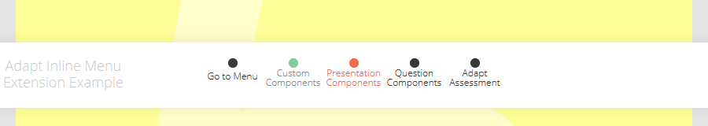

# adapt-inline-menu  
    
An Adapt framework extension to add menu over the pages.




## Installation

First, be sure to install the [Adapt Command Line Interface](https://github.com/cajones/adapt-cli), then from the command line run:

    adapt install inline-menu

Or, download the ZIP and extract into the src > extensions directory and run an appropriate Grunt task.

### Demo

https://kunjsharma.github.io/#/id/co-00

### Usage

Add `_inlineMenu` in course.json:

```
	"_inlineMenu": {
		"_isEnabled": true,
		"title": "Menu",
		"_items": [
	        {
	            "title": "Go to Menu",
	            "description": "",
	            "_link": ""
	        },
	        {
	            "title": "Presentation Components",
	            "description": "",
	            "_link": "co-05"
	        },
	        {
	            "title": "Question Components",
	            "description": "",
	            "_link": "co-10"
	        },
	        {
	            "title": "Adapt Assessment",
	            "description": "",
	            "_link": "co-15"
	        }
		]
	}
```

* `title` Menu item title.
* `description` Item title description (optional).
* `_link` Link to page. Empty sends to main menu.


### Limitations

Developed to work with framework, `properties.schema` requires to edit compatiblity with authoring tool. Contributors are welcome.

### Browser/platform specification

Intended to develop standard Adapt browser/devices specification.

----------------------------
**Version number:**  2.0.0  
**Framework versions:** 4.0.1  
**Author / maintainer:** Kunj <kunjsharma@hotmail.com>  
